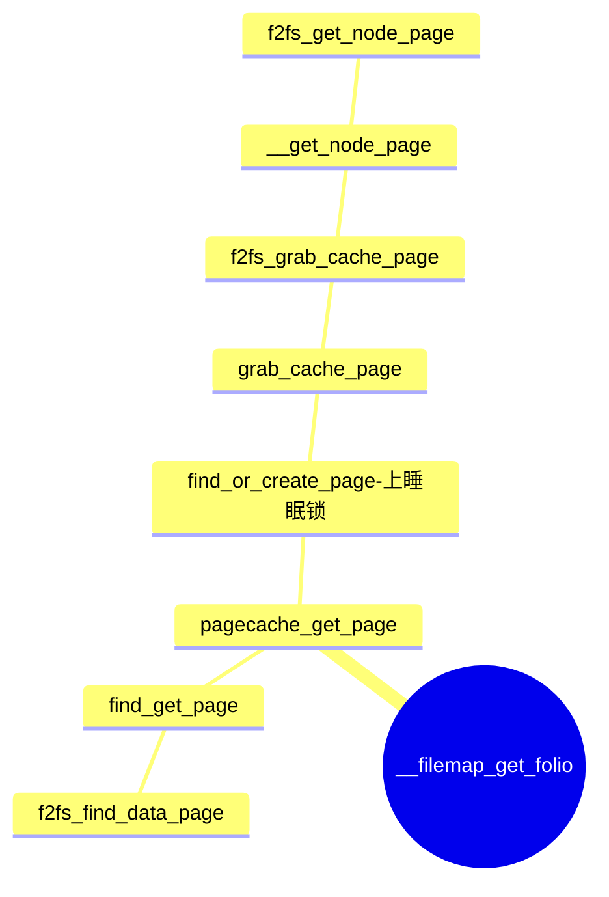

这个README会整理一下所有用到的f2fs从pagecache获取页面中对页面上引用计数的函数。

```mermaid
mindmap
root((__filemap_get_folio))
    pagecache_get_page
        find_get_page
            f2fs_find_data_page
        find_or_create_page-上睡眠锁
            grab_cache_page
                f2fs_grab_cache_page
                    __get_node_page
                        f2fs_get_node_page
```