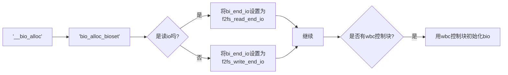
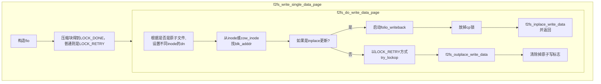

data.c文件中包含f2fs和块设备真正进行io的重要核心函数,也是整f2fs所有和pagecache进行io操作必须调用的函数
`f2fs_submit_page_bio`
另外,还包含了对于普通io来说至关重要的从内存页面到真正物理块映射关系的函数`f2fs_map_blocks`
__bio_alloc调用关系流程图

---
这个板块我们仔细捋一下f2fs提交了一个页面io的全部总流程。

