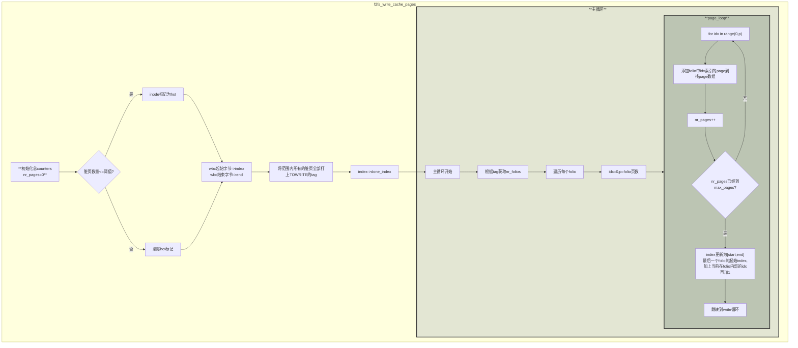

**函数执行流程图**

```C
/*
 * This function was copied from write_cache_pages from mm/page-writeback.c.
 * The major change is making write step of cold data page separately from
 * warm/hot data page.
 */
static int f2fs_write_cache_pages(struct address_space *mapping,
				  struct writeback_control *wbc,
				  enum iostat_type io_type)
{
	int ret = 0;
	int done = 0, retry = 0;
	/*int done = 0, retry = 0;: 
	声明整型变量 done 和 retry 并初始化为 0。
	done: 可能用作循环控制标志，当设置为非 0 值时，可能表示回写操作完成或需要提前结束。
	retry: 可能用作重试标志，当设置为非 0 值时，可能表示需要重试某些操作。*/
	struct page *pages_local[F2FS_ONSTACK_PAGES];
	/*声明一个 page 结构体指针数组 pages_local，大小为 F2FS_ONSTACK_PAGES。
	这很可能是一个 栈上分配的 局部页数组，用于临时存储要写入的页。 
	F2FS_ONSTACK_PAGES 应该是一个宏定义，表示栈上页数组的最大容量。*/
	struct page **pages = pages_local;
	/*声明一个 page 结构体二级指针 pages，并初始化为指向 pages_local 数组。 
	pages 指针将用于后续操作，这样可以根据需要动态地切换到堆上分配的页数组*/
	struct folio_batch fbatch;
	struct f2fs_sb_info *sbi = F2FS_M_SB(mapping);
	struct bio *bio = NULL;
	sector_t last_block;
#ifdef CONFIG_F2FS_FS_COMPRESSION
	struct inode *inode = mapping->host;
	struct compress_ctx cc = {
		.inode = inode,
		.log_cluster_size = F2FS_I(inode)->i_log_cluster_size,
		.cluster_size = F2FS_I(inode)->i_cluster_size,
		.cluster_idx = NULL_CLUSTER,
		.rpages = NULL,
		.nr_rpages = 0,
		.cpages = NULL,
		.valid_nr_cpages = 0,
		.rbuf = NULL,
		.cbuf = NULL,
		.rlen = PAGE_SIZE * F2FS_I(inode)->i_cluster_size,
		.private = NULL,
	};
#endif
	int nr_folios, p, idx;
	int nr_pages;
	unsigned int max_pages = F2FS_ONSTACK_PAGES;
	pgoff_t index;
	pgoff_t end; /* Inclusive */
	pgoff_t done_index;
	int range_whole = 0;
	xa_mark_t tag;
	int nwritten = 0;
	int submitted = 0;
	int i;

#ifdef CONFIG_F2FS_FS_COMPRESSION
	if (f2fs_compressed_file(inode) &&
	    1 << cc.log_cluster_size > F2FS_ONSTACK_PAGES) {
		pages = f2fs_kzalloc(
			sbi, sizeof(struct page *) << cc.log_cluster_size,
			GFP_NOFS | __GFP_NOFAIL);
		max_pages = 1 << cc.log_cluster_size;
	}
#endif

	folio_batch_init(&fbatch);

	if (get_dirty_pages(mapping->host) <=
	    SM_I(F2FS_M_SB(mapping))->min_hot_blocks)
		set_inode_flag(mapping->host, FI_HOT_DATA);
	/*如果脏页数量小于等于 min_hot_blocks 阈值，
		则将 inode 标记为 FI_HOT_DATA (热数据)，否则清除该标记 (冷数据)。*/
	else
		clear_inode_flag(mapping->host, FI_HOT_DATA);

	if (wbc->range_cyclic) {
		/*如果为真，表示回写范围是 循环的 (cyclic)。 
		循环回写通常用于后台周期性的回写操作，从上次停止的位置继续回写。*/
		index = mapping->writeback_index; /* prev offset
		很可能存储了 上次循环回写操作结束时的页偏移量，作为本次循环回写的起始位置。 */
		end = -1;
	} else {
		index = wbc->range_start >> PAGE_SHIFT;
		/*将 wbc->range_start (回写起始位置) 右移 PAGE_SHIFT 位，
		得到起始页的索引，并赋值给 index。*/
		end = wbc->range_end >> PAGE_SHIFT;
		/*将 wbc->range_end (回写结束位置) 右移 PAGE_SHIFT 位，
		得到结束页的索引，并赋值给 end。*/
		if (wbc->range_start == 0 && wbc->range_end == LLONG_MAX)
			range_whole = 1;
		/*条件判断，检查回写范围是否是 整个文件或地址空间。
		如果回写范围是整个文件，则将 range_whole 标志设置为 1。*/
	}
	if (wbc->sync_mode == WB_SYNC_ALL || wbc->tagged_writepages)
		tag = PAGECACHE_TAG_TOWRITE;
	else
		tag = PAGECACHE_TAG_DIRTY;
retry:
	retry = 0;
	if (wbc->sync_mode == WB_SYNC_ALL || wbc->tagged_writepages)
		tag_pages_for_writeback(mapping, index, end);
	/*将范围内所有的脏页全部打上TOWRITE的tag*/
	done_index = index; /*将done_index已经处理完的页初始化为索引起点*/
	while (!done && !retry && (index <= end)) 
   {
		/*循环开始 如果说没有done 没有出现重试并且起始的index小于等于end 等于的情况
		表示一个page*/
		nr_pages = 0;
again:
		nr_folios = filemap_get_folios_tag(mapping, &index, end, tag,
						   &fbatch);
		if (nr_folios == 0) {
			if (nr_pages)
				goto write;
			break;
		}

		for (i = 0; i < nr_folios; i++) {
			struct folio *folio = fbatch.folios[i];

			idx = 0;
			p = folio_nr_pages(folio);
add_more:
			pages[nr_pages] = folio_page(folio, idx);
			folio_get(folio);
			if (++nr_pages == max_pages) {
				index = folio->index + idx +
					1; /*要想知道这里folio->index的大小,
				就得知道filemap_get_folios_tag的实现*/
				folio_batch_release(&fbatch);
				goto write;
			}
			if (++idx < p)
				goto add_more;
		} /*实际上代码逻辑可以重写为二重循环:
		for(int i=0;i<nr_folios;++i)
		{
			folio=fbatch.folio[i]
			p=folio_nr_pages(folio);
			int idx=0;
			for(;idx<p;idx++)
			{
				page[nr_pages]=folio_page(folio,idx);
				folio_get(folio);
				if (++nr_pages == max_pages) {
					index = folio->index + idx + 1;
					folio_batch_release(&fbatch);
					goto write;
				}
			}
		}
		*/
		folio_batch_release(&fbatch);
		goto again;
write: /*开始write循环*/
		for (i = 0; i < nr_pages; i++)
		{
			struct page *page = pages[i];
			struct folio *folio = page_folio(page);
			/*看来是把page再转化回folio
			实现上存在疑问 因为这样似乎是之前把所有的folio拆散现在却又单个page转化回去
			*/
			bool need_readd;
readd:
			need_readd = false;
#ifdef CONFIG_F2FS_FS_COMPRESSION
			if (f2fs_compressed_file(inode)) {
				void *fsdata = NULL;
				struct page *pagep;
				int ret2;

				ret = f2fs_init_compress_ctx(&cc);
				if (ret) {
					done = 1;
					break;
				}

				if (!f2fs_cluster_can_merge_page(
					    &cc, folio->index)) {
					ret = f2fs_write_multi_pages(
						&cc, &submitted, wbc, io_type);
					if (!ret)
						need_readd = true;
					goto result;
				}

				if (unlikely(f2fs_cp_error(sbi)))
					goto lock_folio;

				if (!f2fs_cluster_is_empty(&cc))
					goto lock_folio;

				if (f2fs_all_cluster_page_ready(&cc, pages, i,
								nr_pages, true))
					goto lock_folio;

				ret2 = f2fs_prepare_compress_overwrite(
					inode, &pagep, folio->index, &fsdata);
				if (ret2 < 0) {
					ret = ret2;
					done = 1;
					break;
				} else if (ret2 &&
					   (!f2fs_compress_write_end(
						    inode, fsdata, folio->index,
						    1) ||
					    !f2fs_all_cluster_page_ready(
						    &cc, pages, i, nr_pages,
						    false))) {
					retry = 1;
					break;
				}
			}
#endif
			/* give a priority to WB_SYNC threads */
			if (atomic_read(&sbi->wb_sync_req[DATA]) &&
			    wbc->sync_mode == WB_SYNC_NONE) {
				done = 1;
				break;
			}
#ifdef CONFIG_F2FS_FS_COMPRESSION
lock_folio:
#endif
			done_index =
				folio->index; /*更新已完成的index为folio的起始index*/
retry_write:
			/*为了保证并发下的安全性,我们必须在锁的保护下把之前所有检查过的事项全再检查一遍*/
			folio_lock(folio);
			/*
								在锁的保护下检查folio是否还在内存中了
								*/
			if (unlikely(folio->mapping != mapping)) {
continue_unlock:
				folio_unlock(folio); /*不在的话就解锁continue*/
				continue;
			}

			if (!folio_test_dirty(folio)) {
				/* someone wrote it for us */
				goto continue_unlock;
			}

			if (folio_test_writeback(folio)) {
				if (wbc->sync_mode == WB_SYNC_NONE)
					goto continue_unlock;
				f2fs_wait_on_page_writeback(&folio->page, DATA,
							    true, true);
			}

			if (!folio_clear_dirty_for_io(folio))
				goto continue_unlock;

#ifdef CONFIG_F2FS_FS_COMPRESSION
			if (f2fs_compressed_file(inode)) {
				folio_get(folio);
				f2fs_compress_ctx_add_page(&cc, folio);
				continue;
			}
#endif /*还是只写了一页吗?*/
			ret = f2fs_write_single_data_page(folio, &submitted,
							  &bio, &last_block,
							  wbc, io_type, 0,
							  true);
			if (ret == AOP_WRITEPAGE_ACTIVATE)
				folio_unlock(folio);
#ifdef CONFIG_F2FS_FS_COMPRESSION
result:
#endif
			nwritten += submitted;
			wbc->nr_to_write -= submitted;

			if (unlikely(ret)) {
				/*
				 * keep nr_to_write, since vfs uses this to
				 * get # of written pages.
				 */
				if (ret == AOP_WRITEPAGE_ACTIVATE) {
					ret = 0;
					goto next;
				} else if (ret == -EAGAIN) {
					ret = 0;
					if (wbc->sync_mode == WB_SYNC_ALL) {
						f2fs_io_schedule_timeout(
							DEFAULT_IO_TIMEOUT);
						goto retry_write;
					}
					goto next;
				}
				done_index = folio_next_index(folio);
				done = 1;
				break;
			}

			if (wbc->nr_to_write <= 0 &&
			    wbc->sync_mode == WB_SYNC_NONE) {
				done = 1;
				break;
			}
next:
			if (need_readd)
				goto readd;
		}
		release_pages(pages, nr_pages);
		cond_resched();
	}
#ifdef CONFIG_F2FS_FS_COMPRESSION
	/* flush remained pages in compress cluster */
	if (f2fs_compressed_file(inode) && !f2fs_cluster_is_empty(&cc)) {
		ret = f2fs_write_multi_pages(&cc, &submitted, wbc, io_type);
		nwritten += submitted;
		wbc->nr_to_write -= submitted;
		if (ret) {
			done = 1;
			retry = 0;
		}
	}
	if (f2fs_compressed_file(inode))
		f2fs_destroy_compress_ctx(&cc, false);
#endif
	if (retry) {
		index = 0;
		end = -1;
		goto retry;
	}
	if (wbc->range_cyclic && !done)
		done_index = 0;
	if (wbc->range_cyclic || (range_whole && wbc->nr_to_write > 0))
		mapping->writeback_index = done_index;

	if (nwritten)
		f2fs_submit_merged_write_cond(F2FS_M_SB(mapping), mapping->host,
					      NULL, 0, DATA);
	/* submit cached bio of IPU write */
	if (bio)
		f2fs_submit_merged_ipu_write(sbi, &bio, NULL);

#ifdef CONFIG_F2FS_FS_COMPRESSION
	if (pages != pages_local)
		kfree(pages);
#endif

	return ret;
}
```
我们可以把所有有关压缩的代码暂时去除来简化一下代码的逻辑,简化之后代码如下:
```C
static int f2fs_write_cache_pages(struct address_space *mapping,
				  struct writeback_control *wbc,
				  enum iostat_type io_type)
{
	int ret = 0;
	int done = 0, retry = 0;
	/*int done = 0, retry = 0;: 
	声明整型变量 done 和 retry 并初始化为 0。
	done: 可能用作循环控制标志，当设置为非 0 值时，可能表示回写操作完成或需要提前结束。
	retry: 可能用作重试标志，当设置为非 0 值时，可能表示需要重试某些操作。*/
	struct page *pages_local[F2FS_ONSTACK_PAGES];
	/*声明一个 page 结构体指针数组 pages_local，大小为 F2FS_ONSTACK_PAGES。
	这很可能是一个 栈上分配的 局部页数组，用于临时存储要写入的页。 
	F2FS_ONSTACK_PAGES 应该是一个宏定义，表示栈上页数组的最大容量。*/
	struct page **pages = pages_local;
	/*声明一个 page 结构体二级指针 pages，并初始化为指向 pages_local 数组。 
	pages 指针将用于后续操作，这样可以根据需要动态地切换到堆上分配的页数组*/
	struct folio_batch fbatch;
	struct f2fs_sb_info *sbi = F2FS_M_SB(mapping);
	struct bio *bio = NULL;
	sector_t last_block;
	int nr_folios, p, idx;
	int nr_pages;
	unsigned int max_pages = F2FS_ONSTACK_PAGES;
	pgoff_t index;
	pgoff_t end; /* Inclusive */
	pgoff_t done_index;
	int range_whole = 0;
	xa_mark_t tag;
	int nwritten = 0;
	int submitted = 0;
	int i;
	folio_batch_init(&fbatch);

	if (get_dirty_pages(mapping->host) <=
	    SM_I(F2FS_M_SB(mapping))->min_hot_blocks)
		set_inode_flag(mapping->host, FI_HOT_DATA);
	/*如果脏页数量小于等于 min_hot_blocks 阈值，
		则将 inode 标记为 FI_HOT_DATA (热数据)，否则清除该标记 (冷数据)。*/
	else
		clear_inode_flag(mapping->host, FI_HOT_DATA);

	if (wbc->range_cyclic) {
		/*如果为真，表示回写范围是 循环的 (cyclic)。 
		循环回写通常用于后台周期性的回写操作，从上次停止的位置继续回写。*/
		index = mapping->writeback_index; /* prev offset
		很可能存储了 上次循环回写操作结束时的页偏移量，作为本次循环回写的起始位置。 */
		end = -1;
	} else {
		index = wbc->range_start >> PAGE_SHIFT;
		/*将 wbc->range_start (回写起始位置) 右移 PAGE_SHIFT 位，
		得到起始页的索引，并赋值给 index。*/
		end = wbc->range_end >> PAGE_SHIFT;
		/*将 wbc->range_end (回写结束位置) 右移 PAGE_SHIFT 位，
		得到结束页的索引，并赋值给 end。*/
		if (wbc->range_start == 0 && wbc->range_end == LLONG_MAX)
			range_whole = 1;
		/*条件判断，检查回写范围是否是 整个文件或地址空间。
		如果回写范围是整个文件，则将 range_whole 标志设置为 1。*/
	}
	if (wbc->sync_mode == WB_SYNC_ALL || wbc->tagged_writepages)
		tag = PAGECACHE_TAG_TOWRITE;
	else
		tag = PAGECACHE_TAG_DIRTY;
	while (!done && !retry && (index <= end)) 
	{
		/*
		....
		....
		收集nr_pages的循环
		*/
write: /*开始write循环*/
		for (i = 0; i < nr_pages; i++)
		{
			struct page *page = pages[i];
			struct folio *folio = page_folio(page);
			/*看来是把page再转化回folio
			实现上存在疑问 因为这样似乎是之前把所有的folio拆散现在却又单个page转化回去
			*/
			bool need_readd;
readd:
			need_readd = false;
			/* give a priority to WB_SYNC threads */
			if (atomic_read(&sbi->wb_sync_req[DATA]) &&
			    wbc->sync_mode == WB_SYNC_NONE) {
				done = 1;
				break;
			}
			done_index =
				folio->index; /*更新已完成的index为folio的起始index*/
retry_write:
			/*为了保证并发下的安全性,我们必须在锁的保护下把之前所有检查过的事项全再检查一遍*/
			folio_lock(folio);
			/*
								在锁的保护下检查folio是否还在内存中了
								*/
			if (unlikely(folio->mapping != mapping)) {
continue_unlock:
				folio_unlock(folio); /*不在的话就解锁continue*/
				continue;
			}

			if (!folio_test_dirty(folio)) {
				/* someone wrote it for us */
				goto continue_unlock;
			}

			if (folio_test_writeback(folio)) {
				if (wbc->sync_mode == WB_SYNC_NONE)
					goto continue_unlock;
				f2fs_wait_on_page_writeback(&folio->page, DATA,
							    true, true);
			}

			if (!folio_clear_dirty_for_io(folio))
				goto continue_unlock;
			ret = f2fs_write_single_data_page(folio, &submitted,
							  &bio, &last_block,
							  wbc, io_type, 0,
							  true);
			if (ret == AOP_WRITEPAGE_ACTIVATE)
				folio_unlock(folio);
#ifdef CONFIG_F2FS_FS_COMPRESSION
result:
#endif
			nwritten += submitted;
			wbc->nr_to_write -= submitted;

			if (unlikely(ret)) {
				/*
				 * keep nr_to_write, since vfs uses this to
				 * get # of written pages.
				 */
				if (ret == AOP_WRITEPAGE_ACTIVATE) {
					ret = 0;
					goto next;
				} else if (ret == -EAGAIN) {
					ret = 0;
					if (wbc->sync_mode == WB_SYNC_ALL) {
						f2fs_io_schedule_timeout(
							DEFAULT_IO_TIMEOUT);
						goto retry_write;
					}
					goto next;
				}
				done_index = folio_next_index(folio);
				done = 1;
				break;
			}

			if (wbc->nr_to_write <= 0 &&
			    wbc->sync_mode == WB_SYNC_NONE) {
				done = 1;
				break;
			}
next:
			if (need_readd)
				goto readd;
		}
	}
}
```