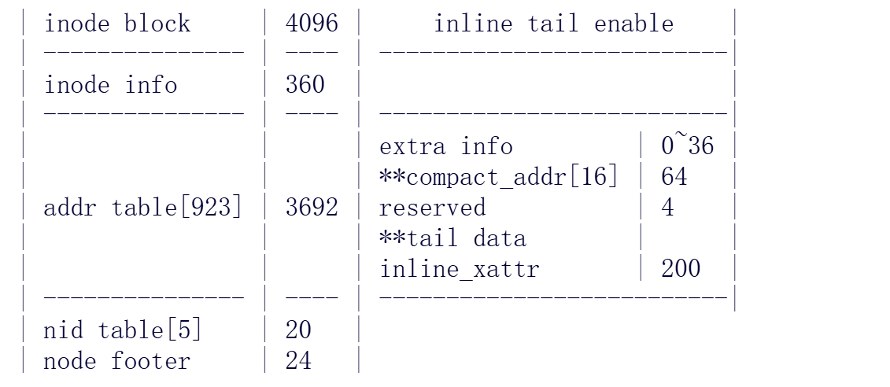

```C
#define ADDRS_PER_INODE(inode)	addrs_per_page(inode, true)
static inline unsigned int addrs_per_page(struct inode *inode,
							bool is_inode)
{
	unsigned int addrs = is_inode ? (CUR_ADDRS_PER_INODE(inode) -
			get_inline_xattr_addrs(inode)) : DEF_ADDRS_PER_BLOCK;

	if (f2fs_compressed_file(inode))
		return ALIGN_DOWN(addrs, F2FS_I(inode)->i_cluster_size);
	return addrs;
}
#define DEF_ADDRS_PER_BLOCK	((F2FS_BLKSIZE - sizeof(struct node_footer)) / sizeof(__le32))
/* Address Pointers in an Inode */
#define DEF_ADDRS_PER_INODE	((F2FS_BLKSIZE - OFFSET_OF_END_OF_I_EXT	\
					- SIZE_OF_I_NID	\
					- sizeof(struct node_footer)) / sizeof(__le32)) //是923
#define CUR_ADDRS_PER_INODE(inode)	(DEF_ADDRS_PER_INODE - \
					get_extra_isize(inode))
#define OFFSET_OF_END_OF_I_EXT		360
#define SIZE_OF_I_NID			 20 //         就是5个nid的字节大小          
#define MAX_INLINE_DATA(inode)	(sizeof(__le32) *			\
				(CUR_ADDRS_PER_INODE(inode) -		\
				get_inline_xattr_addrs(inode) -	\
				DEF_INLINE_RESERVED_SIZE))
/*这个inline数据从其计算公式可以看出来 是抢了直接指针的位置
也就是从inode_info之后开始 删掉末尾的inline_xattr的东西
再减去为inline保存的大小 DEF_INLINE_RESERVED_SIZE不知道为什么固定为1*/
/* for inline stuff */
#define DEF_INLINE_RESERVED_SIZE	1
#define F2FS_TOTAL_EXTRA_ATTR_SIZE			\
	(offsetof(struct f2fs_inode, i_extra_end) -	\
	offsetof(struct f2fs_inode, i_extra_isize))	\
	/* 200 bytes for inline xattrs by default */
#define DEFAULT_INLINE_XATTR_ADDRS	50 /*是50个地址 所以是50*4也就是200字节 这意味着实际上用于数据块的直接指针本来就只有前873个*/
struct f2fs_inode {
	__le16 i_mode;			/* file mode */         // 2 bytes
	__u8 i_advise;			/* file hints */         // 1 byte
	__u8 i_inline;			/* file inline flags */    // 1 byte
	__le32 i_uid;			/* user ID */            // 4 bytes
	__le32 i_gid;			/* group ID */           // 4 bytes
	__le32 i_links;			/* links count */          // 4 bytes
	__le64 i_size;			/* file size in bytes */   // 8 bytes
	__le64 i_blocks;		/* file size in blocks */  // 8 bytes
	__le64 i_atime;			/* access time */          // 8 bytes
	__le64 i_ctime;			/* change time */          // 8 bytes
	__le64 i_mtime;			/* modification time */    // 8 bytes
	__le32 i_atime_nsec;		/* access time in nano scale */ // 4 bytes
	__le32 i_ctime_nsec;		/* change time in nano scale */ // 4 bytes
	__le32 i_mtime_nsec;		/* modification time in nano scale */ // 4 bytes
	__le32 i_generation;		/* file version (for NFS) */ // 4 bytes
	union {                                            // 4 bytes (largest member size)
		__le32 i_current_depth;	/* only for directory depth */
		__le16 i_gc_failures;	/* ... */
	};
	__le32 i_xattr_nid;		/* nid to save xattr */    // 4 bytes
	__le32 i_flags;			/* file attributes */      // 4 bytes
	__le32 i_pino;			/* parent inode number */  // 4 bytes
	__le32 i_namelen; 	/* file name length */     // 4 bytes
   __u8 i_name[F2FS_NAME_LEN];	/* file name for SPOR */ // F2FS_NAME_LEN bytes
   __u8 i_dir_level;		/* dentry_level for large dir */ // 1 byte

   struct f2fs_extent i_ext;	/* caching a largest extent */ // Let's assume for now we know its size later 到此inode info结束。恰好是360字节。

   union {                                            // Union starts here
   	struct {                                     // Anonymous struct inside union
   		__le16 i_extra_isize;	/* extra inode attribute size */ // 2 bytes
   		__le16 i_inline_xattr_size;	/* inline xattr size, unit: 4 bytes */ // 2 bytes
   		__le32 i_projid;	/* project id */         // 4 bytes
   		__le32 i_inode_checksum;/* inode meta checksum */    // 4 bytes
   		__le64 i_crtime;	/* creation time */        // 8 bytes
   		__le32 i_crtime_nsec;	/* creation time in nano scale */ // 4 bytes
   		__le64 i_compr_blocks;	/* # of compressed blocks */ // 8 bytes
   		__u8 i_compress_algorithm;	/* compress algorithm */ // 1 byte
   		__u8 i_log_cluster_size;	/* log of cluster size */ // 1 byte
   		__le16 i_compress_flag;		/* compress flag */    // 2 bytes 到这里为止的字段加起来就有36字节了。这部分对应extra_ihfo。
   		__le32 i_extra_end[0];	/* for attribute size calculation 也就是柔性可变数组*/ // 0 bytes
   	} __packed;                                  // Anonymous struct ends here
   	__le32 i_addr[DEF_ADDRS_PER_INODE];	/* Pointers to data blocks */ // DEF_ADDRS_PER_INODE * 4 bytes
   };                                                // Union ends here
   __le32 i_nid[DEF_NIDS_PER_INODE];	/* direct(2), indirect(2), double_indirect(1) node id */ // DEF_NIDS_PER_INODE * 4 bytes
} __packed;	
```

这是f2fsinode块的布局方式。