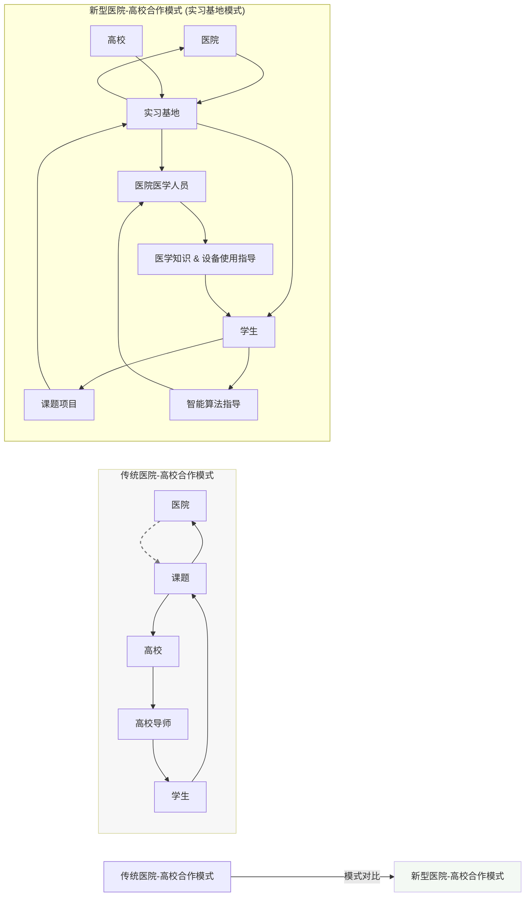
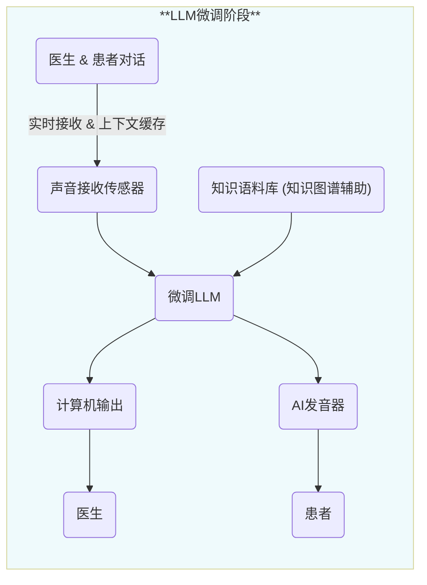

```mermaid
graph LR
    subgraph A["传统医院-高校合作模式"]
    style A fill:#f0f0f0,opacity:0.5
        Hospital_T[医院]
        University_T[高校]
        Professor_T[高校导师]
        Student_T[学生]
        ResearchTopic_T[课题]

        Hospital_T --> ResearchTopic_T
        ResearchTopic_T --> University_T
        University_T --> Professor_T
        Professor_T --> Student_T
        Student_T --> ResearchTopic_T
        ResearchTopic_T --> Hospital_T
    end

    subgraph B["新型医院-高校合作模式 (实习基地模式)"]
    style 新型医院-高校合作模式 fill:#e8f5e9,opacity:0.5
        Hospital_N[医院]
        University_N[高校]
        Student_N[学生]
        MedicalStaff_N[医院医学人员]
        InternshipBase_N[实习基地]
        ResearchProject_N[课题项目]
        AI_AlgorithmGuidance_N[智能算法指导]
        MedicalKnowledge_Equipment_N[医学知识 & 设备使用指导]

        Hospital_N --> InternshipBase_N
        University_N --> InternshipBase_N
        InternshipBase_N --> MedicalStaff_N
        InternshipBase_N --> Student_N

        Student_N --> ResearchProject_N
        ResearchProject_N --> InternshipBase_N
        InternshipBase_N --> Hospital_N

        Student_N --> AI_AlgorithmGuidance_N
        AI_AlgorithmGuidance_N --> MedicalStaff_N

        MedicalStaff_N --> MedicalKnowledge_Equipment_N
        MedicalKnowledge_Equipment_N --> Student_N
    end

    传统医院-高校合作模式 -->|模式对比| 新型医院-高校合作模式
    linkStyle 0 stroke-width:2px,stroke:#757575,stroke-dasharray: 5 5


    
```

```mermaid
graph LR
subgraph Stage2[**LLM微调阶段**]
        LLM2(微调LLM)
        KnowledgeCorpus2("知识语料库 (知识图谱辅助)")
        VoiceSensor2(声音接收传感器)
        ComputerOutput2(计算机输出)
        AISpeaker2(AI发音器)
        DoctorPatientDialogue2(医生 & 患者对话)

        DoctorPatientDialogue2 -- 实时接收 & 上下文缓存 --> VoiceSensor2
        VoiceSensor2 --> LLM2
        KnowledgeCorpus2 --> LLM2
        LLM2 --> ComputerOutput2
        LLM2 --> AISpeaker2
        ComputerOutput2 --> 医生(医生)
        AISpeaker2 --> 患者(患者)
    end
    style Stage2 fill:#e0f7fa,opacity:0.5
```
