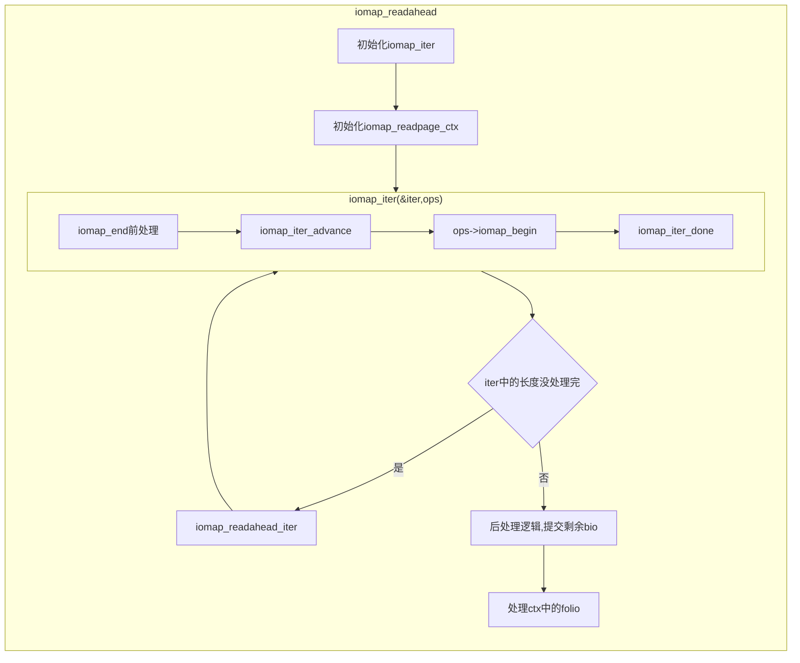

iomap框架进行buffered_io的核心函数。这其中进行buffer_read最核心的函数便是iomap_readahead。以xfs为例,我们来看看iomap_readahead的函数调用流程:

```mermaid
graph LR
    subgraph b["iomap_iter(&iter,ops)"]
        G[iomap_end前处理]-->H[iomap_iter_advance]-->I["ops->iomap_begin"]-->J[iomap_iter_done]
    end
    subgraph a[iomap_readahead]
        A[初始化iomap_iter]-->B[初始化iomap_readpage_ctx]-->b-->C{"iter中的长度没处理完"}
        C--是-->D[iomap_readahead_iter]-->b
        C--否-->E[后处理逻辑,提交剩余bio]-->F[处理ctx中的folio]
    end
    
click A "https://github.com/sigmanature/learn_os_note/blob/main/6.13.1%E5%86%85%E6%A0%B8%E6%96%87%E6%A1%A3%E6%B3%A8%E9%87%8A/include/linux/iomap.h/struct_iomap_iter.md"
```