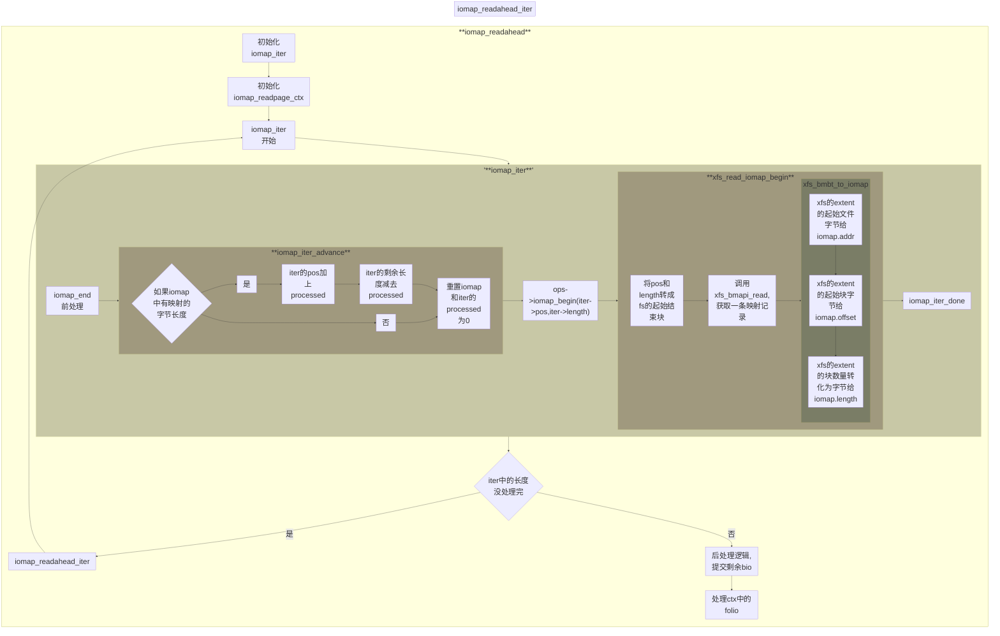
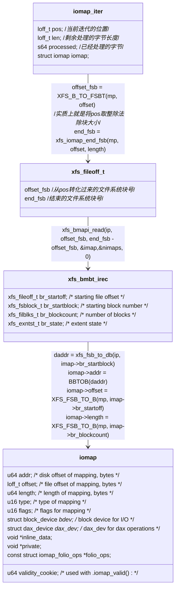

iomap框架进行buffered_io的核心函数。这其中进行buffer_read最核心的函数便是iomap_readahead。以xfs为例,我们来看看iomap_readahead的函数调用流程:

```mermaid
%%{init: {
  "themeVariables": 
{ 
    "fontSize": "37px"  
}
}}%%
graph LR
    subgraph c[**iomap_iter_advance**]
        1{如果iomap中有映射的字节长度}
        1-->是-->iter的pos加上processed-->iter的剩余长度减去processed-->2[重置iomap和iter的processed为0]
        1-->否-->2
    end
    subgraph 5[xfs_bmbt_to_iomap]
    o[xfs的extent的起始文件字节给iomap.addr]-->r[xfs的extent的起始块字节给iomap.offset]-->p[xfs的extent的块数量转化为字节给iomap.length]
    end
    subgraph d[**xfs_read_iomap_begin**]
    3[将pos和length转成fs的起始结束块]-->4["调用xfs_bmapi_read,获取一条映射记录"]-->5
    end
    subgraph b['**iomap_iter**']
        G[iomap_end前处理]-->c-->I["ops->iomap_begin(iter->pos,iter->length)"]-->d-->K[iomap_iter_done]
    end
    style b fill:#775,opacity:0.4
    style c fill:#654,opacity:0.4
    style d fill:#654,opacity:0.4
    style 5 fill:#454,opacity:0.4
    subgraph a[**iomap_readahead**]
        A[初始化iomap_iter]-->B[初始化iomap_readpage_ctx]-->bg[iomap_iter开始]-->b
        b-->C{"iter中的长度没处理完"}
        C--是-->D[iomap_readahead_iter]-->bg
        C--否-->E[后处理逻辑,提交剩余bio]-->F[处理ctx中的folio]
    end
    subgraph e[iomap_readahead_iter]
    
    end
click A "https://github.com/sigmanature/learn_os_note/blob/main/6.13.1%E5%86%85%E6%A0%B8%E6%96%87%E6%A1%A3%E6%B3%A8%E9%87%8A/include/linux/iomap.h/struct_iomap_iter.md"
click 1 "https://github.com/sigmanature/learn_os_note/blob/main/6.13.1%E5%86%85%E6%A0%B8%E6%96%87%E6%A1%A3%E6%B3%A8%E9%87%8A/fs/iomap/iter.c/iomap_iter_advance.md"
click 3 "https://github.com/sigmanature/learn_os_note/blob/main/6.13.1%E5%86%85%E6%A0%B8%E6%96%87%E6%A1%A3%E6%B3%A8%E9%87%8A/fs/xfs/xfs_iomap.c/xfs_read_iomap_begin.md"
click o "https://github.com/sigmanature/learn_os_note/blob/main/6.13.1%E5%86%85%E6%A0%B8%E6%96%87%E6%A1%A3%E6%B3%A8%E9%87%8A/fs/xfs/xfs_iomap.c/xfs_bmbt_to_iomap.md"
click 4 "https://github.com/sigmanature/learn_os_note/blob/main/6.13.1%E5%86%85%E6%A0%B8%E6%96%87%E6%A1%A3%E6%B3%A8%E9%87%8A/fs/xfs/xfs_iomap.c/xfs_bmapi_read.md"
click D "https://github.com/sigmanature/learn_os_note/blob/main/6.13.1%E5%86%85%E6%A0%B8%E6%96%87%E6%A1%A3%E6%B3%A8%E9%87%8A/fs/iomap/buffered_io.c/iomap_readahead_iter.md"
```

```mermaid
classDiagram
    class A["iomap_iter"] {
        loff_t pos; /*当前迭代的位置*/
        loff_t len; /*剩余处理的字节长度*/
        s64 processed; /*已经处理的字节*/
        struct iomap iomap;
    }
    class B["xfs_fileoff_t"]{
    offset_fsb /*从pos转化过来的文件系统块号*/
    end_fsb /*结束的文件系统块号*/
    }
    class C["xfs_bmbt_irec"]{
	xfs_fileoff_t	br_startoff;	/* starting file offset */
	xfs_fsblock_t	br_startblock;	/* starting block number */
	xfs_filblks_t	br_blockcount;	/* number of blocks */
	xfs_exntst_t	br_state;	/* extent state */
    } 
    class D["iomap"] {
	u64			addr; /* disk offset of mapping, bytes */
	loff_t			offset;	/* file offset of mapping, bytes */
	u64			length;	/* length of mapping, bytes */
	u16			type;	/* type of mapping */
	u16			flags;	/* flags for mapping */
	struct block_device	*bdev;	/* block device for I/O */
	struct dax_device	*dax_dev; /* dax_dev for dax operations */
	void			*inline_data;
	void			*private; 
	const struct iomap_folio_ops *folio_ops;
	u64			validity_cookie; /* used with .iomap_valid() */
}
    A --> B : offset_fsb = XFS_B_TO_FSBT(mp, offset) <br> /*实质上就是将pos取整除法除块大小*/<br>end_fsb = xfs_iomap_end_fsb(mp, offset, length)
    B --> C :xfs_bmapi_read(ip, offset_fsb, end_fsb - offset_fsb, &imap,&nimaps, 0)
    C --> D :daddr = xfs_fsb_to_db(ip, imap->br_startblock)<br>iomap->addr = BBTOB(daddr)<br>iomap->offset = XFS_FSB_TO_B(mp, imap->br_startoff)<br>iomap->length = XFS_FSB_TO_B(mp, imap->br_blockcount)
```
