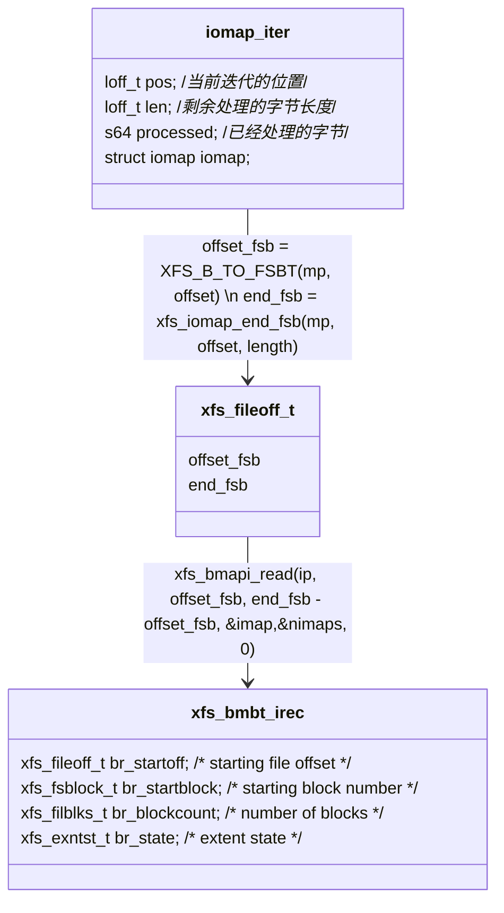

iomap框架进行buffered_io的核心函数。这其中进行buffer_read最核心的函数便是iomap_readahead。以xfs为例,我们来看看iomap_readahead的函数调用流程:
```mermaid
graph LR
    subgraph c[**iomap_iter_advance**]
        1{如果iomap中有映射的字节长度}
        1-->是-->iter的pos加上processed-->iter的剩余长度减去processed-->2[重置iomap和iter的processed为0]
        1-->否-->2
    end
    subgraph d[**xfs_read_iomap_begin**]
    3[将pos和length转成fs的起始结束块]-->4["调用xfs_bmapi_read,获取一条映射记录"]-->5[用xfs_bmbt_to_iomap将映射记录转为iomap]
    end
    subgraph b["**iomap_iter(&iter,ops)**"] 
        G[iomap_end前处理]-->c-->I["ops->iomap_begin(iter->pos,iter->length)"]-->d-->K[iomap_iter_done]
    end
    style b fill:#775,opacity:0.4
    style c fill:#654,opacity:0.4
    style d fill:#654,opacity:0.4
    subgraph a[**iomap_readahead**]
        A[初始化iomap_iter]-->B[初始化iomap_readpage_ctx]-->bg[iomap_iter开始]-->b
        b-->C{"iter中的长度没处理完"}
        C--是-->D[iomap_readahead_iter]-->bg
        C--否-->E[后处理逻辑,提交剩余bio]-->F[处理ctx中的folio]
    end
    
click A "https://github.com/sigmanature/learn_os_note/blob/main/6.13.1%E5%86%85%E6%A0%B8%E6%96%87%E6%A1%A3%E6%B3%A8%E9%87%8A/include/linux/iomap.h/struct_iomap_iter.md"
```
