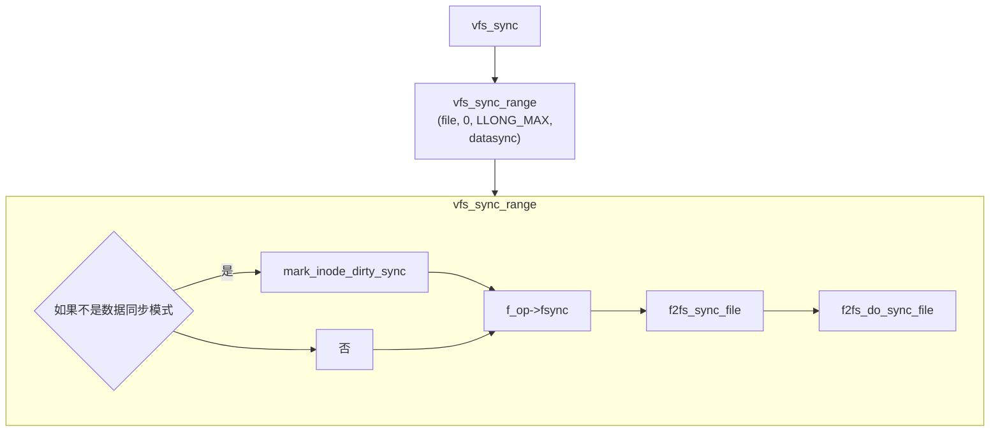

`vfs_fsync`函数是fsync系统调用实际执行的函数。会利用writeback_control将脏页写回范围设置为文件全域。然而实际具体写回多少全由具体文件系统自己的脏页写回策略决定。函数调用关系如下:

```mermaid
%%{wrap:true}%%
graph TD
A[vfs_sync]-->B["vfs_sync_range<br>(file, 0, LLONG_MAX, <br>datasync)"]-->a
subgraph a[vfs_sync_range]
1{如果不是数据同步模式}--是-->2[mark_inode_dirty_sync]-->3["f_op->fsync"]-->4[f2fs_sync_file]-->5[f2fs_do_sync_file]
1-->否-->3
end

```