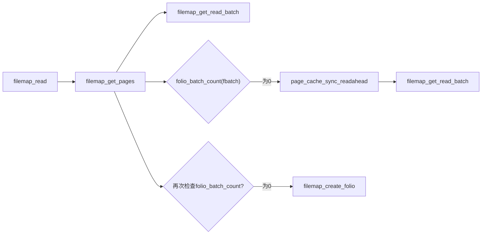
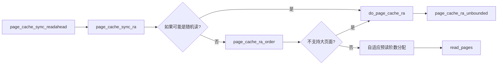

# filemap.c文件大体介绍
filemap是linux各个文件系统进行io的传统方案。
这个文件里存放的是很多和页面缓存的操作以及进行向文件系统进行页面写入操作的文件。(可能从名字不是很大能看出来)
Linux的io模型的两大重要写入函数:
```C++
ssize_t generic_perform_write(struct kiocb *iocb, struct iov_iter *i)
//通用的写盘函数,经过页面缓冲层
ssize_t generic_file_direct_write(struct kiocb *iocb, struct iov_iter *from)
//通用的写盘函数,跨过缓冲层直接写入磁盘
```
定义于此。
然后,还有各个文件系统最重要的实际执行读io的函数,filemap_read。这个函数的调用链很复杂。详见下图:


read_pages函数是真正执行所有预读逻辑的函数。它会调用特定文件系统的预读接口。这里我们以f2fs为例子看一下调用流程图:
