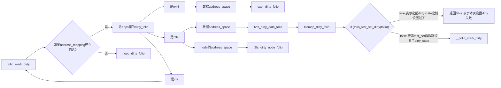
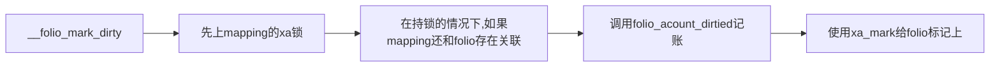

Linux内存管理中所有控制脏页写回的相关函数。

---
脏页标记部分:主要是从folio_mark_ditry开始通过具体文件系统aops中实现的dirty_folio延伸出的分支。不同的文件系统可能会采用不同的标记方式。其中filemap_dirty_folio可能导致写放大。

```mermaid
graph LR
A[folio_mark_dirty]-->B{如果address_mapping还在的话?}
B--是-->C[走aops里的dirty_folio]
B--否-->noop_dirty_folio
C-->L[是ext4]-->E[数据address_space]-->G[ext4_dirty_folio]
C-->I[是f2fs]-->D[数据address_space]-->F[f2fs_dirty_data_folio]-->M[filemap_dirty_folio]-->N{"if (folio_test_set_dirty(folio))"}
N--true,表示之前dirty state之前设置过了-->返回false,表示本次设置dirty失败
N--false,表示test_set函数新设置了dirty_state-->O[__folio_mark_dirty]
I-->J[node的address_space]-->H[f2fs_dirty_node_folio]
C-->K[是xfs]-->A
click A "https://github.com/sigmanature/learn_os_note/tree/main/6.13.1%E5%86%85%E6%A0%B8%E6%96%87%E6%A1%A3%E6%B3%A8%E9%87%8A/mm/page_writeback.c/folio_mark_dirty.md"
click F "https://github.com/sigmanature/learn_os_note/blob/main/6.13.1%E5%86%85%E6%A0%B8%E6%96%87%E6%A1%A3%E6%B3%A8%E9%87%8A/fs/f2fs/data.c/f2fs_dirty_data_folio.md"
click J "https://github.com/sigmanature/learn_os_note/blob/main/6.13.1%E5%86%85%E6%A0%B8%E6%96%87%E6%A1%A3%E6%B3%A8%E9%87%8A/fs/f2fs/node.c/f2fs_dirty_node_folio.md"
click O "https://github.com/sigmanature/learn_os_note/tree/main/6.13.1%E5%86%85%E6%A0%B8%E6%96%87%E6%A1%A3%E6%B3%A8%E9%87%8A/mm/page_writeback.c/__folio_mark_dirty.md"
```

```mermaid
graph LR
A[__folio_mark_dirty]-->先上mapping的xa锁-->在持锁的情况下,如果mapping还和folio存在关联-->B[调用folio_acount_dirtied记账]-->C[使用xa_mark给folio标记上]
click B "https://github.com/sigmanature/learn_os_note/tree/main/6.13.1%E5%86%85%E6%A0%B8%E6%96%87%E6%A1%A3%E6%B3%A8%E9%87%8A/mm/page_writeback.c/folio_acount_dirtied.md"
```