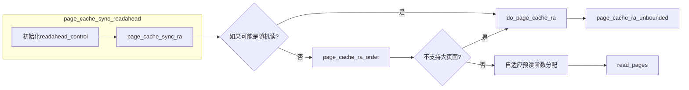

Linux在io之中进行预读的所有函数。最常见的使用场景就是在buffered read中的filemap_read函数中被使用。是Linux进行预读的传统方案。 
[filemap_read](https://github.com/sigmanature/learn_os_note/tree/main/6.13.1%E5%86%85%E6%A0%B8%E6%96%87%E6%A1%A3%E6%B3%A8%E9%87%8A/mm/filemap.c)
以同步预读page_readahead_sync为例子,看一下它们的函数调用关系图。
